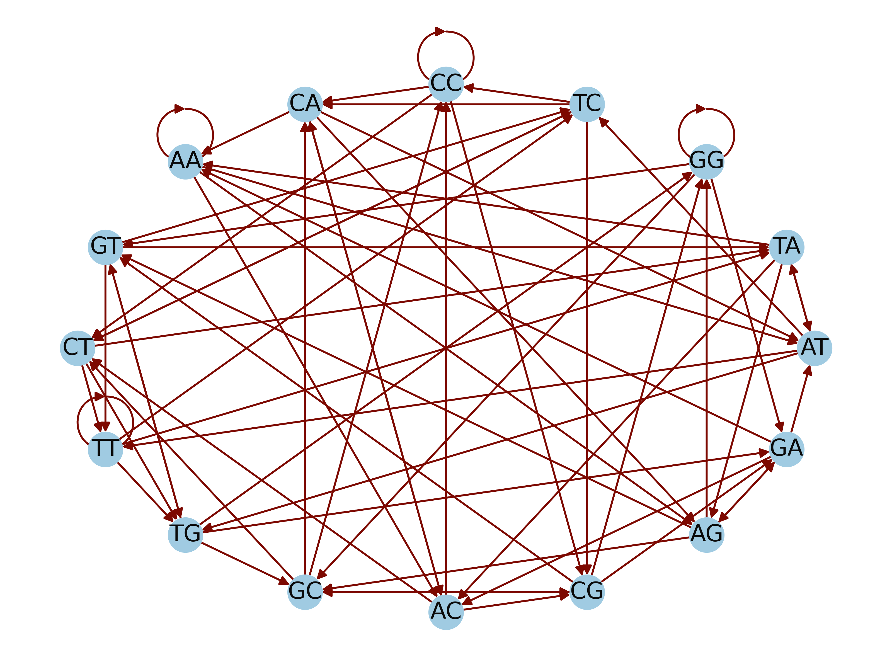

```{r setup, include=FALSE}
knitr::opts_chunk$set(echo = TRUE)
```
## Abstract
Coronaviruses contain a highly conserved genomic region referred to as the spike protein that serves as the bases for their study. This protein has facilitated the understanding of the recently emerged coronavirus disease 2019 (covid19) caused by the severe acute respiratory syndrome coronavirus 2 (SARS-CoV-2) that led to a human pandemic worldwide. Research to understand covid19 has studied the spike protein of SARS-CoV-2 at various multidisciplinary levels in which genetics and genomics have played a major role. The latter has facilitated an understanding of the mechanisms underlying the virulence and pathogenicity as well as evolutionary traits of the virus. This study presents genome assembly from shotgun Illumina sequence reads aligned using a de Bruijn graph. Knowledge of the genetic arrangement of the virus has provided knowledge for the development of vaccines for clinical trials and deployment, and the understanding of the evolution of the virus for prevention and the generation of new tools for reducing the impact of the disease.  

## Objective 
Assemble the genome of SARS-CoV-2 from shotgun sequencing data using the de Bruijn graph

## Introduction
SARS-CoV-2 is a single-stranded RNA virus containing a spike protein with two know subunits, subunit 1 and subunit 2. Mechanistically the spike protein is important for host recognition and virulence. However, the genetic information of the spike protein facilities identifying mutations, and most importantly it is a target for the development of treatments for covid19.  

In genome assembly, repetitive regions can lead to inaccurate assemblies. To overcome this limitation, 

## Results
In 1-2 paragraphs, describe what you did and what you found. It is essential to consider and discuss alternative approaches that you could have used (or tried to use) and why your eventual choices were justified.

## Conclusion
Restate the purpose of your re-analysis. Summarize and synthesize your findings. Briefly describe future work.

## Methods
Raw reads of the SARS-CoV-2 spike protein were cleaned up using the quality trimmer Trimmomatic and sequencing errors were corrected using the external program Lighter, a kmer-based error correction method. Once cleaned, the sequences were broken into a list of k-mers to perform analyses. First, we created a the De Bruijn graph using (k-1)-mers as nodes, in which an Eulerian path traversed all k-mers. Second, we implemented XX algorithm to find an Eulerian path/circuit, and to assemble the genome. We used XX to correct issues including extra edges that could not be traversed, and duplicate edges. Finally, we aligned at least one assembled contig to the spike protein from the genes (Supplementary data 1) and assessed the correlation of the coordinates of the assembled location of each base against the known location of each base. When the alignment was not successful with a single whole contig, they were broken into smaller sequences of length 100 and aligned each of those, then plotted them all together. 

## Acknowledgments 
We thank the CSCI5481 course.

\newpage
\onecolumn
```{r echo=FALSE, out.width="100%", fig.align ='center', fig.cap="de Bruijn Graph"}
library(knitr)

```
## References

1.	Kolmogorov, M., Yuan, J., Lin, Y. & Pevzner, P. A. Assembly of long, error-prone reads using repeat graphs. Nat. Biotechnol. 37, 540–546 (2019).
2.	Maduranga, U. Genome Assembly using de Bruijn Graphs. Medium https://towardsdatascience.com/genome-assembly-using-de-bruijn-graphs-69570efcc270 (2020).
3.	Compeau, P. E. C., Pevzner, P. A. & Tesler, G. How to apply de Bruijn graphs to genome assembly. Nat. Biotechnol. 29, 987–991 (2011).
4.	Song, L. Lighter. (2022).
5.	Huang, Y., Yang, C., Xu, X., Xu, W. & Liu, S. Structural and functional properties of SARS-CoV-2 spike protein: potential antivirus drug development for COVID-19. Acta Pharmacol. Sin. 41, 1141–1149 (2020).
6.	Bosch, B. J., van der Zee, R., de Haan, C. A. M. & Rottier, P. J. M. The coronavirus spike protein is a class I virus fusion protein: structural and functional characterization of the fusion core complex. J. Virol. 77, 8801–8811 (2003).
7.  Compeau, P. E. C., Pevzner, P. A. & Tesler, G. Why are de Bruijn graphs useful for genome assembly? Nat. Biotechnol. 29, 987 (2011).


